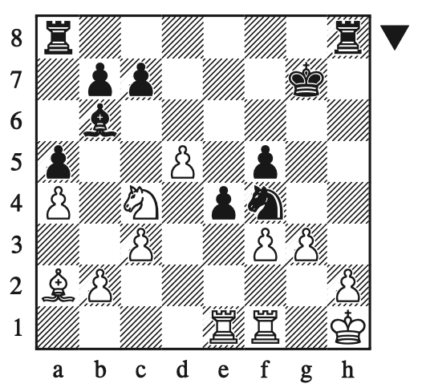
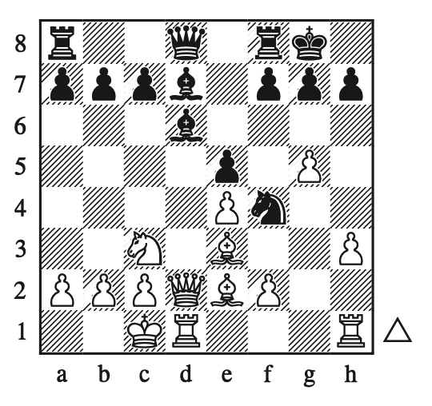
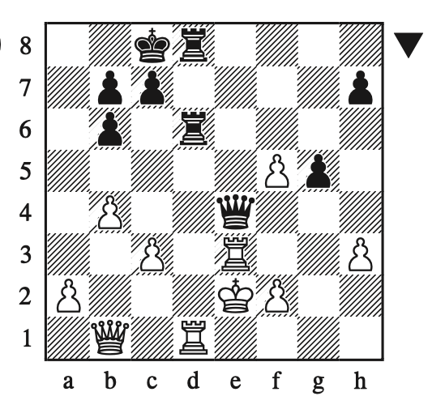
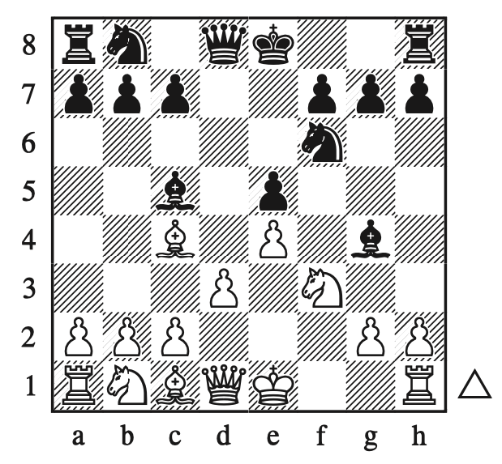
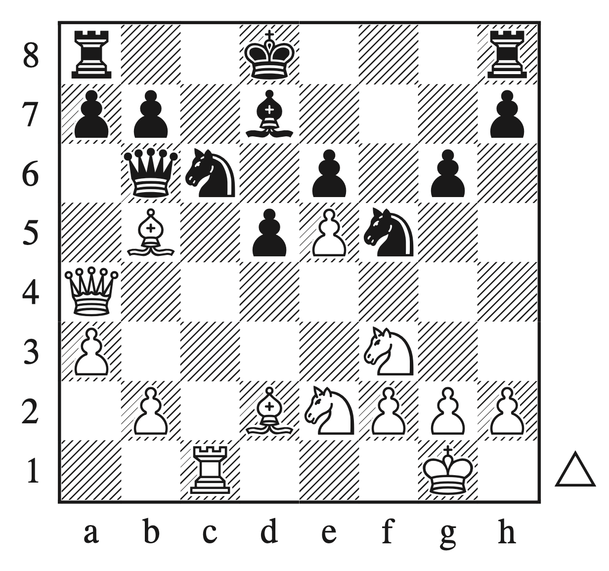

# The Woodpecker Method

- [Easy Exercises](#easy-exercises)
  - [1: Hamppe – Steinitz, Vienna 1860](#1-hamppe--steinitz-vienna-1860)
  - [2: Steinitz – Wilson, London 1862](#2-steinitz--wilson-london-1862)
  - [3: Steinitz – Dubois, London (6) 1862](#3-steinitz--dubois-london-6-1862)
  - [4: Green – Steinitz, London (1) 1864](#4-green--steinitz-london-1-1864)

## Easy Exercises

### 1: Hamppe – Steinitz, Vienna 1860

- [Board](https://lichess.org/study/fmCGaziQ/1kiIy1C0)

- All the black pieces are pointing towards the king: knight, bishop, rook
- Knights close to the king blocking two fleeing squares is a real threat
  - A possible problem: when knights are not guarded (protected)
- Bishop attacking another fleeing square
  - A possible problem: white knight can exchange pieces (knight takes bishop, pawn takes knight)
- Look at the king a find what are the spots missing for a mate
  - In this position, king can't go anywhere but black need a check
  - The only possible check is rook xh2 but the rook is not protected
  - King should capture rook and move to the only possible spot
  - Rook h8 check-mate

### 2: Steinitz – Wilson, London 1862

- [Board](https://lichess.org/study/fmCGaziQ/3xbXMcxD)

- Find possible ways to check the king
  - Rook f8 protected by bishop
  - d6, opening diagonal for bishop, check
- Find a way to move black bishop from d6
  - Bishop f8 is not a good move because it doesn't check, bishop can take your bishop, you open the diagonal moving the pawn, king has a new fleein square in the diagonal from your captured bishop

### 3: Steinitz – Dubois, London (6) 1862

- [Board](https://lichess.org/study/fmCGaziQ/6WpdNogJ)

- There's no initial attack the will lead to a check. The closest one is g6 but it looks like a very weak move
- There's this structure of power: queen + 2 bishops w/ pawn protecting bishop (black) vs queen and rook. The has enough power to defend
- Find ways to destroy this structure
  - One way is bishop c5 but it will lead to just exchange of pieces
  - Another way is to have the pawn e5 attacking bishop
    - Bishop can choose to stay there and be captured by the pawn or capture the pawn and leave its position
    - If bishop stays there, xd6, xd6, queen d7, queen d7, rook d7 (black will lose two bishops in this move)
    - If bishop captures pawn, queen d7, queen d7, rook d7. White with one with advantage of one piece

### 4: Green – Steinitz, London (1) 1864

- [Board](https://lichess.org/study/fmCGaziQ/qYbzh8BY)

- Find possible ways to check
  - queen g4: simple block with rook f3 (simply lose the queen — pawn is guarding this square)
  - queen c4: simple block with rook d3 (more power on the d file)
  - queen c2: simply lose the queen
  - rook d2: check and white should protect the king with capturing the rook
    - White queen doesn't have more its defender: queen takes queen
    - Exchange of rook for a queen

### 5: Steinitz – Barry, Dublin (simul) 1865

- [Board](https://lichess.org/study/fmCGaziQ/XbKDrY1P)

- Find possible ways to check
  - The only option for check is bishop f7
    - King should take the the bishop
    - Knight takes pawn and check
    - In these moves, white already took two pawns and and black took a bishop
    - King should move
    - Knight takes bishop (xg4)
    - Knight takes knight (xg4)
    - Queen takes knight (xg4)

### 6: Fraser – Steinitz, Dundee 1867

- [Board](https://lichess.org/study/fmCGaziQ/lRgdCxcj)

- Find possible ways to check
  - Bishop g5 but there's interposition by knight and king can easily move to a fleeing square
- Take a look at the diagonal of queen and king: we can take advantage of that and win a queen
  - The bishop can go a5 but there's a knight protecting that square
  - The bishop can take care of the knight but the bishop can capture our bishop and attack our queen. Rook will need to capture the bishop and the rook will be captured by the pawn. This move make us lose the hook and exchange bishops
  - Another approach: rook takes the knight, pawn captures the rook, bishop a5, queen is pinned.
