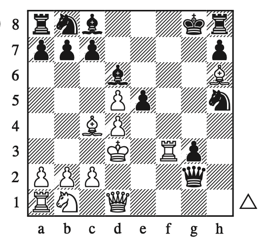
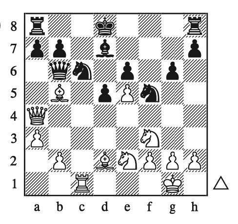
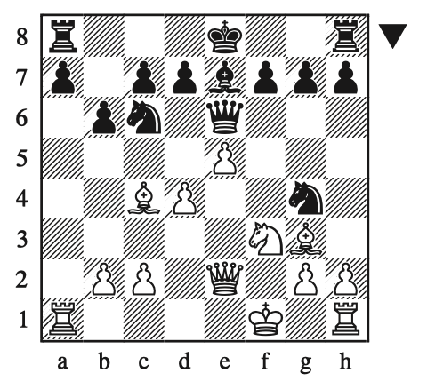

# The Woodpecker Method

- [The Woodpecker Method](#the-woodpecker-method)
  - [Easy Exercises](#easy-exercises)
    - [1: Hamppe – Steinitz, Vienna 1860](#1-hamppe--steinitz-vienna-1860)
    - [2: Steinitz – Wilson, London 1862](#2-steinitz--wilson-london-1862)
    - [3: Steinitz – Dubois, London (6) 1862](#3-steinitz--dubois-london-6-1862)
    - [4: Green – Steinitz, London (1) 1864](#4-green--steinitz-london-1-1864)
    - [5: Steinitz – Barry, Dublin (simul) 1865](#5-steinitz--barry-dublin-simul-1865)
    - [6: Fraser – Steinitz, Dundee 1867](#6-fraser--steinitz-dundee-1867)
    - [7: Steinitz – Baker, London (simul) 1868](#7-steinitz--baker-london-simul-1868)
    - [8: Steinitz – Minckwitz, Baden-Baden 1870](#8-steinitz--minckwitz-baden-baden-1870)
    - [9: Steinitz – Fleissig, Vienna 1873](#9-steinitz--fleissig-vienna-1873)
    - [10: Steinitz – Gelbfuhs, Vienna 1873](#10-steinitz--gelbfuhs-vienna-1873)
    - [11: Steinitz – Meitner, Vienna 1882](#11-steinitz--meitner-vienna-1882)
    - [12: Blackburne – Steinitz, London 1883](#12-blackburne--steinitz-london-1883)
    - [13: Gunsberg – Steinitz, New York (2) 1890](#13-gunsberg--steinitz-new-york-2-1890)
    - [14: Gunsberg – Steinitz, New York (2) 1890](#14-gunsberg--steinitz-new-york-2-1890)
    - [15: Steinitz – Van Foreest, Haarlem (simul) 1896](#15-steinitz--van-foreest-haarlem-simul-1896)
  - [Resources](#resources)

## Easy Exercises

### 1: Hamppe – Steinitz, Vienna 1860

- [Board](https://lichess.org/study/fmCGaziQ/1kiIy1C0)

- All the black pieces are pointing towards the king: knight, bishop, rook
- Knights close to the king blocking two fleeing squares is a real threat
  - A possible problem: when knights are not guarded (protected)
- Bishop attacking another fleeing square
  - A possible problem: white knight can exchange pieces (knight takes bishop, pawn takes knight)
- Look at the king a find what are the spots missing for a mate
  - In this position, king can't go anywhere but black need a check
  - The only possible check is rook xh2 but the rook is not protected
  - King should capture rook and move to the only possible spot
  - Rook h8 check-mate

### 2: Steinitz – Wilson, London 1862

- [Board](https://lichess.org/study/fmCGaziQ/3xbXMcxD)

- Find possible ways to check the king
  - Rook f8 protected by bishop
  - d6, opening diagonal for bishop, check
- Find a way to move black bishop from d6
  - Bishop f8 is not a good move because it doesn't check, bishop can take your bishop, you open the diagonal moving the pawn, king has a new fleein square in the diagonal from your captured bishop

### 3: Steinitz – Dubois, London (6) 1862

- [Board](https://lichess.org/study/fmCGaziQ/6WpdNogJ)

- There's no initial attack the will lead to a check. The closest one is g6 but it looks like a very weak move
- There's this structure of power: queen + 2 bishops w/ pawn protecting bishop (black) vs queen and rook. The has enough power to defend
- Find ways to destroy this structure
  - One way is bishop c5 but it will lead to just exchange of pieces
  - Another way is to have the pawn e5 attacking bishop
    - Bishop can choose to stay there and be captured by the pawn or capture the pawn and leave its position
    - If bishop stays there, xd6, xd6, queen d7, queen d7, rook d7 (black will lose two bishops in this move)
    - If bishop captures pawn, queen d7, queen d7, rook d7. White with one with advantage of one piece

### 4: Green – Steinitz, London (1) 1864

- [Board](https://lichess.org/study/fmCGaziQ/qYbzh8BY)

- Find possible ways to check
  - queen g4: simple block with rook f3 (simply lose the queen — pawn is guarding this square)
  - queen c4: simple block with rook d3 (more power on the d file)
  - queen c2: simply lose the queen
  - rook d2: check and white should protect the king with capturing the rook
    - White queen doesn't have more its defender: queen takes queen
    - Exchange of rook for a queen

### 5: Steinitz – Barry, Dublin (simul) 1865

- [Board](https://lichess.org/study/fmCGaziQ/XbKDrY1P)

- Find possible ways to check
  - The only option for check is bishop f7
    - King should take the the bishop
    - Knight takes pawn and check
    - In these moves, white already took two pawns and and black took a bishop
    - King should move
    - Knight takes bishop (xg4)
    - Knight takes knight (xg4)
    - Queen takes knight (xg4)

### 6: Fraser – Steinitz, Dundee 1867

- [Board](https://lichess.org/study/fmCGaziQ/lRgdCxcj)

- Find possible ways to check
  - Bishop g5 but there's interposition by knight and king can easily move to a fleeing square
- Take a look at the diagonal of queen and king: we can take advantage of that and win a queen
  - The bishop can go a5 but there's a knight protecting that square
  - The bishop can take care of the knight but the bishop can capture our bishop and attack our queen. Rook will need to capture the bishop and the rook will be captured by the pawn. This move make us lose the hook and exchange bishops
  - Another approach: rook takes the knight, pawn captures the rook, bishop a5, queen is pinned.

### 7: Steinitz – Baker, London (simul) 1868

- [Board](https://lichess.org/study/fmCGaziQ/HAPyVbVX)

- Find possible ways to check
  - Queen takes pawn, king should capture queen, and rook checks. King has many fleeing squares
- Rook takes bishop, queen takes rook, pawn f3, queen can defend with f1
- Pawn f3, queen should take it. Queen moving to f3 can't defend the bishop anymore. Rook captures bishop. Exchange of bishop for a pawn.

### 8: Steinitz – Minckwitz, Baden-Baden 1870

- [Board](https://lichess.org/study/fmCGaziQ/7B7DJQ4g)

- Find possible ways to check
  - There are some ways of checking but both ways you lose the knight without hurting the opponent
  - When going knight e3, the only piece protecting the king is the queen: ask yourself how to move the queen away of that position
    - knight d4 is not that good: bishop can capture your queen, you can capture the queen and you can trade bishop for a knight — or just lose the knight (captured by their knight)
    - queen takes bishop is interesting: queen should take the queen and move away from that position — knight can check and and capture the queen in this process. You trade the queens but also capture the bishop

### 9: Steinitz – Fleissig, Vienna 1873

- [Board](https://lichess.org/study/fmCGaziQ/FpbSdqKs)

- Find possible ways to check
  - The first throught was to rook d6 but bishop can easily capture the rook with pawn capturing the bishop. So it's basically an exchange of a rook for a bishop. Not good.
- Rook on b5 is only protected by the king. What if move a piece to distract the king?
  - rook capture knight
  - king capture rook
  - king capture rook
  - we have a rook and a knight for a rook

### 10: Steinitz – Gelbfuhs, Vienna 1873

- [Board](https://lichess.org/study/fmCGaziQ/nBkQEUrJ)

- Find possible ways to check
  - Queen takes knight: pawn should take queen and it opens space to bishop mate

### 11: Steinitz – Meitner, Vienna 1882

- [Board](https://www.365chess.com/game.php?gid=2692434)

- Find possible ways to check
  - Bishop f7, king should not take bishop because knight can take another pawn, check and capture the bishop when the king run away

### 12: Blackburne – Steinitz, London 1883

- [Board](https://lichess.org/study/fmCGaziQ/SvMdpWSQ)

- Queen h6 check
- King has two fleeing squares
- Rook f8 check (Rook is protected by the queen, king can't take it, so queen should take the rook, leaving the e7 position)
- Black queen is not protecting the pawn on h7 anymore, queen takes pawn, and check mate

### 13: Gunsberg – Steinitz, New York (2) 1890

- [Board](https://www.chess.com/analysis/game/pgn/44zYJ6U7HQ?tab=analysis)

- knight c3. Bishop capture knight, bishop capture rook

### 14: Gunsberg – Steinitz, New York (2) 1890

- rook d3, queen d3, queen e1, queen d1, queen captures queen mate
- rook d3, bishop g2, rook d8, a4, rook d1, rook d1, queen d1, knight d1

### 15: Steinitz – Van Foreest, Haarlem (simul) 1896

- [Board](https://lichess.org/study/fmCGaziQ/6hNIOjvq)

- queen captures rook check
  - king captures queen, rook e1 check mate
  - king h2, bishop f4 check mate

## Resources

- [Easy: 1 - 50](https://lichess.org/study/KxpQnika)
- [Easy: 51 - 100](https://lichess.org/study/4gzGL3Gt)
- [Easy: 101 - 150](https://lichess.org/study/D2bCZhgA)
- [Easy: 129 - 192](https://lichess.org/study/1iCUxzuS/fLoH5CKB)
- [Easy: 193 - 254](https://lichess.org/study/Lmzzz2XE)
- [Easy: 201 - 222](https://lichess.org/study/Cw7kju9J)